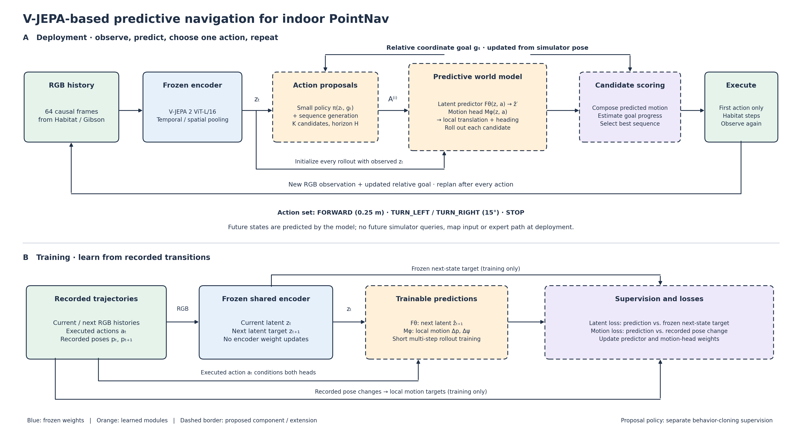

# Final agreed thesis scope and implementation plan

Agreed with the student on 6 October 2026. This replaces the earlier proposal's
central comparison of direct V-JEPA control against predictive control. Historical
implementation reports retain their original dates and evidence boundaries.

## Title and objective

**Design and Evaluation of a V-JEPA-Based World Model for Indoor Point-Goal Navigation**

This is an implementation-led experimental thesis: adapt, integrate and evaluate
a predictive navigation system, including a working simulation demonstration.
A new algorithm and beating published results are not assumed requirements.
Formal supervisor acceptance of the scope has not yet been established.

**Research question:** How effectively can a V-JEPA-based predictive navigation
system navigate unseen indoor buildings, and what performance and computational
trade-offs does it show against an established non-world-model RGB PointNav agent?

The external agent is the main comparison. Disabling our predictive look-ahead is
a supporting ablation to determine what the world model contributes.

## Fixed scope

| Item | Decision |
|---|---|
| Environment | Habitat-Sim + Habitat-Lab, currently pinned to 0.3.3 |
| Dataset | Official Gibson PointNav episodes and Habitat-compatible scenes |
| Perception | RGB history and the pinned frozen V-JEPA 2 ViT-L/16 encoder |
| Goal | Fixed coordinate destination; Habitat supplies the updated relative goal |
| Localization | Relative goal uses simulator ground-truth pose; camera-only localization is not claimed |
| Goal convention | `(forward, left, up)` in metres; no target orientation |
| Actions | `FORWARD`, `TURN_LEFT`, `TURN_RIGHT`, `STOP` |
| Current movement | Forward 0.25 m; turns 15 degrees |
| Current success rule | STOP at geodesic distance strictly below 0.2 m |
| Current episode limit | 500 actions |
| Current camera/agent | 224-pixel square RGB, 90-degree HFOV, 1.5 m camera height, 0.1 m agent radius |
| Generalization | Buildings excluded from navigation training/development; no model-weight adaptation there |
| Hardware | One RTX 4090 with working Linux/CUDA/EGL; Mac for development |
| Demonstration | Recorded simulation with first-person and top-down views |

Backward movement, velocity/waypoint outputs, language, real-robot deployment and
ROS integration are outside the core scope. Maps/poses may supply supervision,
metrics and videos; they are not policy inputs except for the stated current goal
vector. The learned planner cannot query future simulator states or expert paths.

The existing 64-frame causal history, first-frame padding and pooled features are
the starting representation. Version any changes and apply them consistently in
offline and online inference. Action-boundary sampling does not necessarily match
the encoder's original video cadence.

## Proposed system

**Figure 1. Proposed navigation architecture.** (A) A frozen V-JEPA 2 encoder
represents the observed RGB history. A goal-conditioned policy proposes candidate
action sequences; the learned world model predicts their latent states and local
motion. The planner estimates progress toward the coordinate goal, executes only
the selected sequence's first action, and replans from the next observation.
(B) Recorded transitions provide frozen next-state latent targets and pose-derived
motion targets for training. The proposal policy uses separate behavior-cloning
supervision from expert actions.

Blue denotes frozen weights; orange denotes learned modules. Dashed borders mark
proposed components or extensions: the encoder and direct policy already exist,
but sequence generation, the dynamics predictor, motion head and predictive
planner remain to be implemented. The figure describes the intended system, not
an experimentally validated result. `z` is a visual latent representation,
`g` the relative coordinate goal, `a` a discrete action, `K` the candidate count,
and `H` the planning horizon. Habitat updates `g` from the true current pose;
the learned model supplies future-state predictions. No goal image is required.

Figure downloads: [vector PDF](figures/pointnav_architecture.pdf) ·
[editable SVG](figures/pointnav_architecture.svg).
The [figure source](figures/pointnav_architecture.py) regenerates all three formats.

1. Encode the observed RGB history once per decision with frozen V-JEPA.
2. Use a small goal-conditioned policy to propose a bounded set of short action sequences.
3. Predict the future latent states resulting from those sequences.
4. Predict local translation/heading changes and, if training data supports it,
   collision risk. Compose predicted motion to estimate progress toward the goal.
5. Score candidates, execute the selected sequence's first action, observe and replan.

Start with a small candidate budget and short horizon. Predictions must influence
action choice. Latent prediction loss alone cannot score progress toward a
coordinate goal; the motion/value connection is necessary. Short-horizon distance
minimization can fail on necessary detours, which must be tested explicitly.

## Current evidence

**Update, 6 October:** the all-431-transition diagnostic completed with 14/15
successes and mean SPL 0.928724. All 14 trained episodes succeeded; the excluded
Anaheim/19466 episode failed. See [verification limits and results](FULL_PILOT_RESULTS.md).
The table below preserves the earlier 32-example experiment's evidence.
The [next experiment configuration and commands](GIBSON_EXPERIMENT.md) now prepare
10 training, three development and five reserved final buildings from actual assets.
The worker import fix is committed in `50054fb`.

Base code: `1986e39` on `codex/vjepa-direct-baseline`. The successful RunPod run also
used a worker import-isolation patch. Its local implementation and regression
test were already uncommitted when this documentation was written.

Downloaded `pilot-1986e39` artifacts were independently inspected on 6 October:

| Component | Evidence/status |
|---|---|
| Expert pilot | 15 expert successes reported from RunPod |
| Reviewed training inputs | 14 episodes, 431 transitions; Anaheim/19466 excluded for severe black frames |
| V-JEPA runtime/cache | Successful encoder log; complete cache with valid hashes, shapes and finite values |
| Tiny direct policy | Recomputed 32/32 selected examples correct; 44/399 other cached examples correct |
| Learned integration rollouts | All 15 trajectory/video hashes checked; 1 success, 14 early-STOP failures |
| Consistency | Trained checkpoint hash matches rollout controller; resolved split matches checkpoint |
| Manifest bookkeeping | All 15 entries finished, but downloaded manifest has `complete: false` and no summary; reconcile export |
| Full-data learned navigation | Pending |
| External baseline | Candidate sources identified; compatibility/execution pending |
| Dynamics, motion head, planner | Not implemented |
| Unseen-building evaluation/demo | Pending |

The 399 additional examples are from the same pilot buildings, not independent
validation. Original expert trajectories and pretrained encoder weights were not
in the download, so their raw contents could not be independently rehashed or
re-encoded locally. No local Habitat rerun is claimed.

## Milestone 1 — reliable learned navigation and benchmark protocol

Target: week 1.

- Preserve the worker fix in the experiment commit and reconcile the RunPod
  manifest. Keep the original pilot evidence.
- Train on all 431 retained cached transitions in a separate output directory.
  The existing CLI supports `--tiny-steps 431`; this remains a labeled integration
  and resubstitution check. Examine action metrics, STOP precision/recall and all
  15 original rollout requests before assuming more data will solve failures.
- Select one reproducible external RGB PointNav agent. Official Habitat RGB PPO
  checkpoints are candidates, not confirmed drop-in dependencies. Verify sensor
  and goal inputs, action sizes/mapping, preprocessing, recurrent resets, runtime
  and training/tuning scene provenance.
- Freeze a shared protocol before larger collection. Resolve any incompatibility
  with pretrained weights explicitly; alternatively reproduce a compatible baseline
  with a documented training budget. Different published protocols cannot establish
  a measured leaderboard ranking of our system.
- Materialize disjoint train/development/final buildings. Pilot buildings stay out
  of final evaluation. Check external-model training overlap and disclose any
  validation/checkpoint-selection exposure in published models.
- Start with approximately 200 training and 50 development episodes across
  multiple buildings. Benchmark extraction on 10–20 episodes before scaling
  toward 1,000–2,000 if justified. These are budgets, not accuracy guarantees.
- Collect, audit, review exclusions, resolve inputs, then extract. Persist raw
  trajectories and caches; keep the active runtime/source on local pod disk.

**Deliverable:** recorded learned navigation on documented development routes,
metrics for the full development set, and a saved external-baseline/protocol
decision. Expert demonstrations alone do not satisfy this milestone.

## Milestone 2 — predictive model and navigation integration

Target: week 2 and early week 3.

- Construct aligned `(z_t, action_t, z_t+1, local_pose_delta_t, collision_t)` pairs.
  The current cache has T features for T actions, not T+1. Extend terminal feature
  extraction or explicitly omit the final transition from dynamics targets.
- Implement lightweight action-conditioned latent prediction and a local-motion
  head, with one-step and short multi-step training/validation.
- The retained expert pilot has zero collisions. Collect separately labeled
  alternative-action/recovery data on training buildings. Keep arbitrary actions
  out of expert behavior-cloning labels and report the additional data. Train
  collision prediction only when relevant examples support it.
- Compare latent prediction against persistence (`z_next = z_now`) and motion
  against nominal action movement. Overlapping video histories mean low latent
  error alone does not establish useful action prediction.
- Implement policy-guided candidates, predictive scoring and replanning without
  future simulator queries. Log candidate actions, predicted motion/costs, selected
  action and planning time. Test turns, blocked movement, detours, loops and STOP.

**Deliverable:** a closed-loop controller whose predictions affect decisions,
prediction-error measurements and development recordings. If it fails, label that
result honestly; policy-only/expert videos are not world-model navigation evidence.

## Milestone 3 — unseen-building evaluation and presentation

Target: remaining week 3 and week 4; reserve several days for writing.

- Freeze checkpoints, settings, success rules and final episode requests.
- Compare the complete system, external agent and no-look-ahead ablation on the
  same episodes. The ablation tests prediction's contribution, not superiority of
  V-JEPA over all other encoders.
- Report success/SPL, final distance, collisions, failures, latency and training
  data. Interpret collisions alongside movement/completion. Retain failed requests
  and runtime errors in the accounting.
- Report per-building results and uncertainty that acknowledges episode clustering.
  Use additional training seeds if time permits; label single-seed results if not.
- Predefine difficulty groups using development data and report every final group.
  Do not tune on final buildings. Zero-shot transfer means no weight adaptation
  there, not absence of previous navigation training.
- Produce learning curves, outcome comparisons, prediction errors and path plots
  from actual artifacts. Record RGB/top-down videos with start/goal, action labels,
  predicted versus actual motion and explicit playback speed. Present aggregate
  results and a failure example alongside successful illustrations.

**Deliverable:** results tables, figures, reproducible source/configuration and
checkpoint records, thesis discussion and a recorded simulation demonstration.
Improvement over another method is measured, not promised.

## Implementation boundaries and immediate task

Reuse `src/simulator`, `src/navigation`, `src/data` and `src/baseline`; add focused
world-model/planning modules as needed. Avoid another restructuring or a large
reporting framework. Keep generated datasets/checkpoints outside Git.

**Next task:** complete the all-431 pilot diagnostic and external-baseline
compatibility check. Larger training follows a known protocol and measured
extraction/storage cost. GPU verification remains on RunPod or the university
RTX 4090; local tests cannot establish learned navigation performance.

## References and guides

- [Gibson guide](GIBSON_PILOT.md)
- [Existing direct-policy commands](DIRECT_BASELINE.md)
- [Milestone checklist](MILESTONES.md)
- [Habitat baseline candidates](https://github.com/facebookresearch/habitat-lab/blob/main/habitat-baselines/README.md)
- [V-JEPA 2](https://arxiv.org/abs/2506.09985)
- [Policy-guided JEPA navigation reference](https://arxiv.org/abs/2603.25981)

These papers motivate the design; their improvements do not automatically
transfer to this implementation or task.
